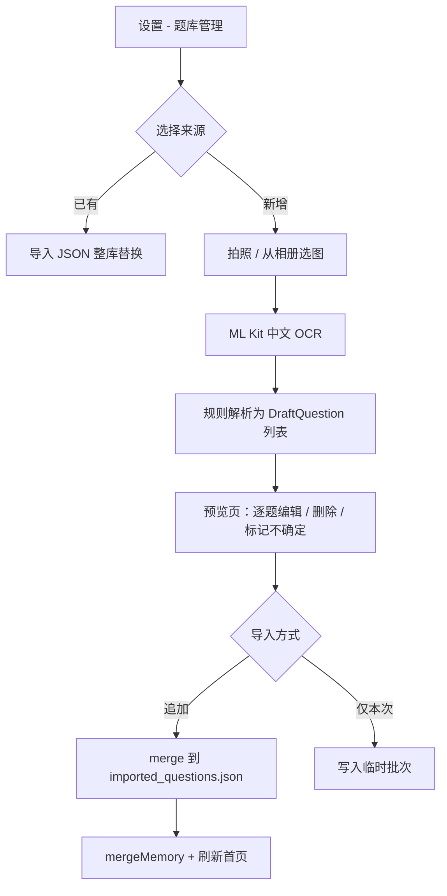

# OCR 拍照导入题库 — 方案说明

> **状态**：规划中（Android 1.14 目标）  
> **依赖**：[跨端规格 SPEC.md](./SPEC.md) 中的 `Question` 模型  
> **原则**：离线优先、必须人工预览、默认追加而非整库覆盖

---

## 1. 为什么要预览

OCR 只能得到**无序文本**，而题库需要结构化字段（题干、选项、答案、题型）。拍屏、倾斜、换行混乱会导致：

- 选项 A/B/C/D 粘连或漏识别  
- 答案行识别成 `答案：C` / `( C )` / `【答案】C` 等多种格式  
- 一图多题或半道题  

因此 **MVP 必须包含「识别 → 解析 → 预览编辑 → 确认导入」**，不能一键静默入库。

---

## 2. 用户流程（Android MVP）



**与 JSON 导入的差异**

| 方式 | 行为 | 适用 |
|------|------|------|
| JSON 文件 | **整文件替换** `imported_questions.json` | 完整题库迁移 |
| OCR 批次 | **按 id 合并追加**（新 id 插入，同 id 可选覆盖） | 几页试卷、零散补题 |

---

## 3. 技术选型（Android）

| 组件 | 选型 | 理由 |
|------|------|------|
| OCR 引擎 | **Google ML Kit Text Recognition v2（Chinese）** | 离线、免费、集成简单 |
| 拍照 | `ActivityResultContracts.TakePicture` + FileProvider | 权限简单 |
| 相册 | `PickVisualMedia` / `GetContent("image/*")` | Android 13+ 无需 READ 权限 |
| 解析 | 自研 `OcrQuestionParser`（规则 + 正则） | 可控、可单测 |
| 异步 | `viewModelScope` + `Dispatchers.Default` | 不阻塞 UI |

**Gradle 依赖（实施时添加）**

```kotlin
implementation("com.google.mlkit:text-recognition-chinese:16.0.1")
// 可选：implementation("androidx.camera:camera-camera2:…") 若要做取景器
```

**Manifest**

- `CAMERA`（仅拍照时需要，运行时申请）  
- `FileProvider` 用于拍照临时 URI  

**包体积**：中文模型首次运行下载约 2–5 MB（ML Kit 动态分发）。

---

## 4. 中间模型 `DraftQuestion`

解析与 UI 之间使用草稿类型，允许字段不完整：

```kotlin
data class DraftQuestion(
    val draftId: String,           // 会话内 UUID，非最终题号
    val id: String = "",           // 用户可填，空则导入时自动生成 OCR-001
    val type: String = "单选",      // 单选 | 判断
    val stem: String = "",         // 题干
    val options: List<String> = emptyList(),  // 选项
    val answer: String = "",       // 正确选项
    val expl: String = "",         // 题目解析
    val answerExpl: String = "",   // 正确选项解析
    val optionExpls: Map<String, String> = emptyMap(),  // 各选项解析（可选）
    val confidence: Float = 0f,
    val warnings: List<String> = emptyList(),
    val sourceLineRange: IntRange? = null,
)
```

确认导入时映射为正式 `Question` 并校验。

---

## 5. 文本解析规则（`OcrQuestionParser`）

### 5.1 预处理

1. 统一全角标点 → 半角（可选）  
2. 合并多余空行  
3. 按行 split，保留行号  

### 5.2 题块切分

**题号行**（新题开始）示例：

```regex
^(?:\d+[\.、．)]|\(\d+\)|第\s*\d+\s*题|练\d+单选\d+|练\d+判断\d+)
```

遇到题号行 → 开启新 block，上一 block 提交解析。

### 5.3 单选题

| 部分 | 识别规则 |
|------|----------|
| 题干 | 题号行之后、首个选项行之前 |
| 选项 | 行首 `^[A-Da-d][\.、．\)]\s*` 或 `^[A-Da-d]\s+` |
| 答案 | 行匹配 `答案[:：]\s*([A-Da-d])`、`\(([A-Da-d])\)`、`【答案】([A-Da-d])` |
| 解析 | `解析[:：]` 后全文，或答案行之后到下一题 |

**校验**

- 单选：`options.size >= 2`（理想 4），`answer` 为 A–D 之一  
- 不足 4 选项 → `warnings += "选项不完整"`，`confidence *= 0.7`  

### 5.4 判断题

| 部分 | 识别规则 |
|------|----------|
| 题干 | 同单选 |
| 选项 | 仅两行「正确」「错误」或 OCR 成「对/错」→ 归一化 |
| 答案 | `答案[:：]\s*(正确|错误|对|错|√|×)` |
| type | 固定 `"判断"` |

若无 A/B/C/D 且含正确/错误关键词 → 判为判断题。

### 5.5 自动题号

导入时 `id` 为空则生成：`OCR-{timestamp}-{序号}`，避免与内置库冲突。

---

## 6. 预览 UI（`OcrImportReviewScreen`）

**列表项展示**

- 题型 Chip、confidence 颜色（绿/黄/红）  
- 题干预览、选项折叠  
- warnings 醒目提示  

**编辑**

- 每字段 TextField 可改  
- 删除单题、手动「添加一题」  
- 底部：**导入 N 题** / 取消  

**空结果**

- OCR 无文本 → Toast「未识别到文字，请重拍」  
- 解析 0 题 → 展示原始 OCR 文本供用户复制排查  

---

## 7. 入库 API（扩展 `QuestionRepository`）

```kotlin
// 规划接口
fun mergeQuestions(incoming: List<Question>, onDuplicateId: DuplicatePolicy): Result<MergeStats>

enum class DuplicatePolicy { SKIP, REPLACE, RENAME }

data class MergeStats(val added: Int, val updated: Int, val skipped: Int)
```

**流程**

1. 读取当前 effective 题库（导入文件或内置）  
2. 合并 incoming  
3. 写入 `imported_questions.json`（首次 OCR 即从内置 copy 再 merge，或仅含 OCR 题 — **推荐：若尚无导入文件，以「内置 + OCR 追加」写入 imported**）  
4. `reload()` + `progress.mergeMemoryAfterImport()`  

**推荐策略（首次 OCR）**

- 无 `imported_questions.json`：以 **内置题库副本 + OCR 题 merge** 写入 imported，避免用户丢失内置 604 题。  
- 已有 imported：在 imported 上 append。  

---

## 8. ViewModel 职责

```kotlin
// 规划
sealed class OcrImportState {
    object Idle
    object Recognizing
    data class Preview(val drafts: List<DraftQuestion>, val rawText: String)
    object Importing
    data class Done(val stats: MergeStats)
    data class Error(val message: String)
}

fun startOcrFromUri(imageUri: Uri)
fun updateDraft(draftId: String, …)
fun confirmImport(selectedDraftIds: List<String>)
```

设置页新增按钮：**「拍照 / 相册识别导入」**，与 JSON 导入并列。

---

## 9. Android 实施分期

### Phase 1 — 基础链路（1.14-alpha）

- [ ] ML Kit 集成 + 相册选图 OCR  
- [ ] `OcrQuestionParser` + 单元测试（用 fixture 文本，非图像）  
- [ ] 预览页只读列表 + 导入 merge  
- [ ] 设置页入口  

### Phase 2 — 体验（1.14 / 1.15）

- [x] 逐题编辑、删除、手动加题  
- [x] 拍照（Camera + 权限 + FileProvider）  
- [x] confidence / warnings UI  
- [x] 导入前「重复 id」策略选择（跳过 / 覆盖 / 重命名）  
- [x] 预览会话内追加识别（再次拍照/选图合并到当前批次）

### Phase 3 — 增强

- [x] 多图批量 OCR 合并预览  
- [x] 导出当前批次为 JSON（方便校对后分享）  
- [x] 可选：框选题目区域裁剪（提升准确率）  

---

## 10. iOS / 鸿蒙移植要点

| 步骤 | iOS | HarmonyOS NEXT |
|------|-----|----------------|
| OCR | `VNRecognizeTextRequest`（zh-Hans） | `@kit.CoreVisionKit` text recognition |
| 解析 | **共用本 spec 第 5 节规则**，各端实现 `OcrQuestionParser` | 同左 |
| 预览 UI | SwiftUI Form + List | ArkUI List + TextInput |
| 合并 | 同 `mergeQuestions` 语义 | 同左 |

**三端共享**：`DraftQuestion` 字段、正则规则、合并策略、测试 fixture（`docs/fixtures/ocr/` 待加样例 txt）。

---

## 11. 测试 fixture 计划

在 `docs/fixtures/ocr/` 放置纯文本样例（模拟 OCR 输出）：

- `single_page_mixed.txt` — 2 单选 + 1 判断  
- `bad_linebreaks.txt` — 换行错乱  
- `missing_answer.txt` — 缺答案，测 warnings  

Android 单元测试：`OcrQuestionParserTest` 只测文本 → `DraftQuestion`，不依赖 ML Kit。

---

## 12. 风险与边界

| 风险 | 缓解 |
|------|------|
| 版式差异大 | 预览编辑 + 样例驱动迭代正则 |
| 识别率低 | 提示用户拍正、光线充足；Phase 3 裁剪 |
| 题库膨胀 | merge 时重复 id 策略；展示导入统计 |
| 包体积 | ML Kit 按需下载模型 |

**不做（MVP 范围外）**

- 云端 OCR / LLM 自动拆题（可作为后续 Pro 能力）  
- 自动识别解析/口诀（字段留空，用户手填）  
- PDF 直接导入  

---

## 13. 下一步（Android）

1. 新增 `docs/fixtures/ocr/` 样例文本 + `OcrQuestionParserTest`  
2. 实现 `OcrQuestionParser` + `mergeQuestions`  
3. 集成 ML Kit，做 `OcrImportReviewScreen`  
4. 设置页增加入口，发 1.14-beta 内测  

确认样张试卷拍照后，可微调第 5 节正则以提高命中率。
